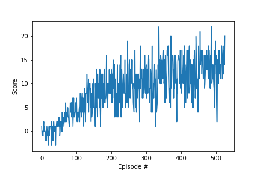

# Objective

The objective of this assignment is to train an agent to navigate in a square world and collect as many yellow bananas as possible while at the same time avoiding blue bananas.

# The environment

The environment used for the analysis is the Banana Collector environment from Unity, modified by Udacity.

**Reward:** + 1 for collecting a yellow banana, - 1 for collecting a blue banana.
**State Space:** 37 dimensions that contain the agent's velocity and a ray-based perception of objects around the agent's forward direction
**Actions:** The four discrete actions are

- 0: move forward
- 1: move backward
- 2: turn left
- 3: turn right

**Final Objective:** The problem is considered solved, when the agent gets an average score of +13 over 100 consecutive episodes

# Learning Algorithm

The methodology used to solve this problem is called deep-Q-network and it was first implemented in [this](https://storage.googleapis.com/deepmind-media/dqn/DQNNaturePaper.pdf) paper. A few words about this approach:

- **Q-learning** belongs in the value-based Reinforcement Learning algorithms where the goal is to maximize the Action Value Function (Q Function)
- **Q-Function** determines the combined value of being at a certain state and following a certain action at that state
- **Deep-Q-Network** combines Reinforcement Learning with a class of artificial neural networks, known as Deep Neural Networks (DNNs). In particular the architecture that is used is deep convolutional networks, which exploit the local spatial correlations that are present in images.
- **Model:** Since we are using a ray-based perception of what the agents see instead of an actual image, the model in our case is not a CNN but a deep neural network that consists only of fully connected layers. In particular we have three fully connected layers:
  - One that starts from the state size (37) and has an ouput of 64
  - A 64-to-64 layer
  - A 64-to-4 (action size) layer
- **Exploration-Exploitation:** We follow an epsilon greedy strategy. We start with a big epsilon at the beginning of the training and we generate a random number. If the number is higher than epsilon, then we will choose the optimal action otherwise we will do exploration. As the training proceeds, the epsilon gets smaller so we move more towards exploitation
- **Hyperparameters:** We have used the same parameters as recommended in the Udacity solution (epsilon decay of 0.995, a mini-batch size of 64, a network update every 4 steps etc.). For future work it would be interesting to see if we can cross the threshold (+13) in less episodes by optimizing these parameters
- **Saved model weights:** After training the agent we store the model weights in a file called 'checkpoint.pth'

# Results

### DQN

By observing the plot of average scores we see that there is an accelerated learning after the first 20-30 episodes, which is followed by a slow and steady growth. The environment is solved after 427 episodes.

We also load the saved torch model to evaluate the performance of the model in testing mode. The average score that we got for 5 iterations is 13.6, which is above the target threshold.
